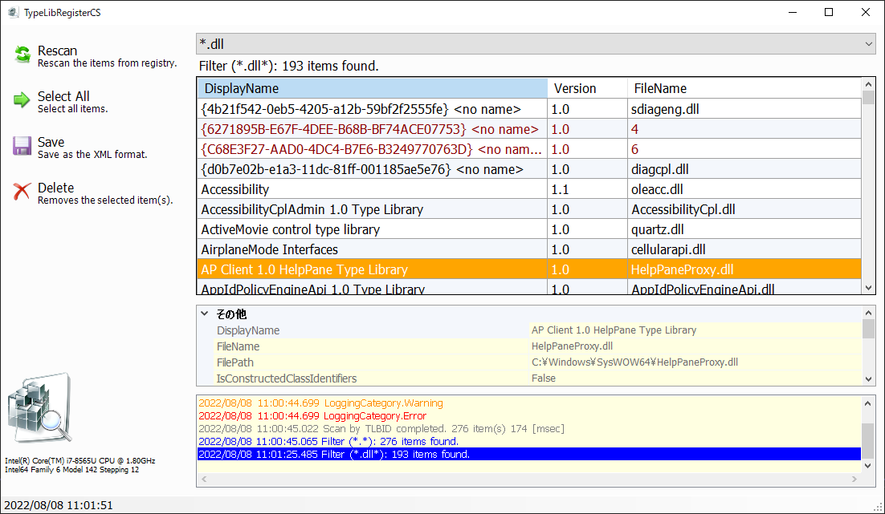
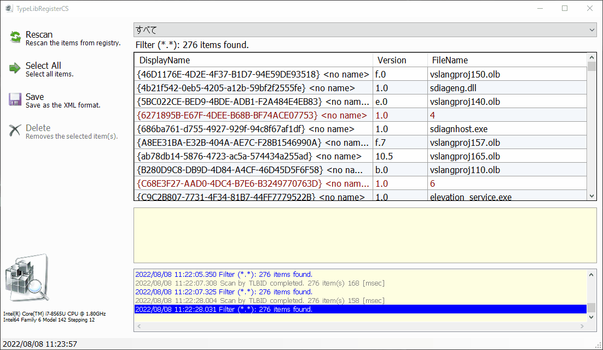

# TypeLibRegisterCS

This tool lists and removes each ActiveX component registered in the Windows registry.

Windows レジストリに登録されている各ActiveXコンポーネントの一覧表示、および削除を行うツールです。

## 参考
* [ActiveX コンポーネントで作成されるレジストリエントリ](https://github.com/MareMare/TypeLibRegisterCS/raw/main/doc/ActiveX%20%E3%82%B3%E3%83%B3%E3%83%9D%E3%83%BC%E3%83%8D%E3%83%B3%E3%83%88%E3%81%A7%E4%BD%9C%E6%88%90%E3%81%95%E3%82%8C%E3%82%8B%E3%83%AC%E3%82%B8%E3%82%B9%E3%83%88%E3%83%AA%E3%82%A8%E3%83%B3%E3%83%88%E3%83%AA.pdf)
* [Q183771: INFO: Registry Entries Made by an ActiveX Component](https://jeffpar.github.io/kbarchive/kb/183/Q183771/)
